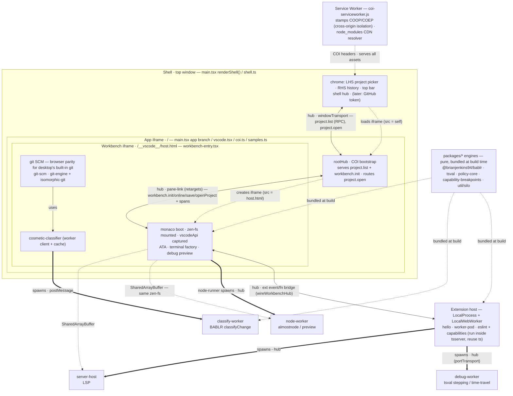

# editor — architecture & "where does this code go?"

The editor spans ~six runtime **realms** (separate JS execution contexts). Most "where should this live?"
confusion is really "which realm does it need to run in?" — so this doc is the realm map plus a placement
procedure. For the capability-overlay subsystem specifically, read `extensions/capabilities/ARCHITECTURE.md`
after this; this doc is the whole-editor picture.

## The two axes behind every placement decision

1. **Which realm?** — decided by *what the code needs to touch* (DOM? the vscode API? the workspace filesystem?
   tsserver's Program? heavy CPU?). Placement follows the CAPABILITY the code needs, not the feature it belongs to.
2. **Engine or binding?** — a pure, reusable **engine** (fewest host deps, node-testable) kept separate from a thin
   **binding** that maps it into one realm. This axis cuts across every realm.

**Portability caveat — the tie-breaker on Axis 1.** The **workbench iframe** realm is *our* custom
monaco-vscode-api boot; it does **not** exist in desktop VS Code, and neither do the browser shims that recreate
what desktop ships built-in. Split product functionality by one question: **does desktop VS Code already provide
this?**

- **Browser-parity shim** — desktop gives it to you out of the box; we only rebuilt it because the browser lacks the
  underpinning (e.g. **git SCM**: desktop's bundled git extension provides it, but that shells out to a `git` binary
  the browser has none of). This is a **browser-host concern**. It is *not* meant to port (desktop uses its own), so
  keep it browser-side — the workbench realm, or a browser-only extension — and do **not** dress it up as a portable
  product extension (no `extensions/git/`; that would imply we ship SCM to desktop, which we don't).
- **Novel functionality** — desktop does *not* provide it (e.g. the capability overlay; the **BABLR cosmetic/
  semantic classifier**). *This* is what should be **portable** → a self-contained **extension** (ext host,
  `vscode.workspace.fs`, spawning its own workers) that runs on both our browser host and desktop VS Code, layered
  on top of whatever SCM/host is present. The `capabilities` extension is the model.

Reserve `workbench-entry` (the workbench realm) for host-**boot glue** proper (the monaco `boot()` call, mounting
zen-fs, the terminal process factory, registering extensions) — and for browser-parity shims that have nowhere more
natural to sit. **Known debt:** the BABLR classifier is currently welded into our browser git SCM (workbench realm);
as *novel* functionality it should be extracted into a standalone extension, decoupled from our git provider, so it
also works over desktop's built-in git.

## The realms

| Realm | Entry / key files | Can access | What lives here |
|---|---|---|---|
| **Shell** (top window) | `main.tsx` `renderShell()` branch, `shell.ts`, `git-panel.ts` | DOM, the shell hub; *later* the GitHub token (trust boundary) | Surrounding chrome: LHS project picker, top bar, and the RHS **git review panel** (`git-panel.ts` — GitHub-Desktop-style changes/diff/commit, a pure hub consumer of `git.*`). Loads the app in an iframe pointing back at the same page. |
| **App iframe** (`/`) | `main.tsx` app branch, `coi.ts`, `vscode.tsx`, `samples.ts`, `pane-link.ts` | DOM, `rootHub`, COI bootstrap | Boots the workbench iframe (+ preview iframe) and links it into `rootHub` over the retargeting pane-link transport; serves `project.list` + `workbench.init`, routes `project.open` → `openProject`. Owns the top of the hub tree. |
| **Workbench iframe** (`/__vscode__/host.html`) | `workbench-entry.tsx`, `workspace-fs.ts`, `ata.ts`, `terminal.ts`, `node-runner.ts`, `git-scm.ts`, `git-service.ts` | **the vscode API *and* zen-fs** (both live here), DOM — but it is OUR boot, so nothing here ports to desktop VS Code | Host-boot glue: the monaco `boot()`, mounting zen-fs, capturing the vscode API, the terminal process factory, registering extensions, spawning the workers. *(git SCM `git-scm.ts`/`git-engine.ts` install here too — legitimate browser parity for desktop's built-in git; the BABLR classifier welded into it is the part that should become a standalone extension.)* |
| **Extension host** (`LocalProcess` / `LocalWebWorker`) | `extensions/*/extension.ts`, `extensions/*/ts-plugin.js` | the vscode API — **no DOM, no zen-fs singleton** | Extensions: `hello` (default API context), `worker-pod` (spawns the LSP/debug/node workers). `eslint` + `capabilities` run in the WebWorker host *inside tsserver*, reusing tsserver's own `ts` as TS-plugins. |
| **Workers** (`dist/lsp/*`, spawned from the workbench realm) | only what is messaged in | nothing host-y | Heavy/blocking compute, off the UI thread: `node-worker` (almostnode/preview), `debug-worker` (tsval stepping), `server-host`, `git-classify-worker` (BABLR classify). |
| **Packages** (`packages/*`, plain node) | nothing host-y — pure | — | Engines: `@brianjenkins94/bablr` (`cstSpans`, `classifyChange`), `tsval`, `util/silo`, and the vscode-package-local pure modules `policy-core`, `capability-breakpoints`. Built/aliased into the realms above. |

There is also a **service worker** (`coi-serviceworker.js`, registered by `coi.ts`): one per origin, it stamps the
COOP/COEP headers that make every realm cross-origin-isolated (SharedArrayBuffer) on a static host, and resolves the
CDN `node_modules` overlay. Not a place you put feature code.

## Cross-realm communication

- **hub** (`@brianjenkins94/hub`) — the composed message tree for *everything*, including the workbench boot
  handshake: pub/sub + RPC (`createRpcClient` / `serve`). Shape today: shell ↔ app over `windowTransport`; app
  `rootHub` ↔ workbench hub over the **pane-link** transport (`pane-link.ts`) — a `windowTransport` variant that
  *retargets* to the pane's live window so it survives a pop-out; workbench ↔ extension pod over the pod's exported
  event/function bridge; pod ↔ its workers over `portTransport`. A message only crosses a link if the far side
  subscribed, so each realm runs standalone. The app↔workbench boot handshake is just hub messages on that link:
  the pane requests `workbench.init` (RPC, retried until interest settles), then publishes `workbench.online` /
  `workbench.save`, and the host publishes `workbench.openProject`. (This folded the old separate `pane-bus` + a
  dedicated `MessagePort` into one hub link; hub's `hello` handshake covers the lossy-window race the port guarded.)
- **plain postMessage** — fine for a single-purpose worker with one request/response shape (e.g. `classify-worker`).

## Diagram — realms & channels

Edge styles: **solid arrows** = live message channels; **thick arrows** = a realm spawning a worker; **dotted arrows**
= frame creation, shared-memory, service-worker serving, and build-time bundling. Nesting = iframe containment
(shell ▸ app ▸ workbench).

## Placement procedure

Ask, in order:

1. **Pure logic, no host deps?** → a **package / engine module** (node-testable). *e.g. `classifyChange`, `git-engine`
   (no vscode dep), `policy-core`, `capability-breakpoints`.*
2. **NOVEL product functionality** (desktop VS Code does *not* provide it)? → a self-contained **extension** in the
   ext host, reaching the workspace through **`vscode.workspace.fs`** (never a direct `zen-fs` import), and
   **spawning any heavy worker itself**. Model: the `capabilities` extension. *The BABLR cosmetic classifier belongs
   here — it is currently welded into our browser git SCM (debt).*
   - **2b. Browser parity for a desktop built-in** (desktop provides it; we only rebuilt it for the browser — e.g.
     git SCM)? → keep it **browser-side** (the workbench realm, or a browser-only extension). It does **not** port,
     so do not make it a portable product extension.
3. **Needs tsserver's Program / to run during type-checking?** → a **TS-plugin in the WebWorker ext host**, reusing
   tsserver's `ts`. *e.g. `capabilities`, `eslint`.* (A special case of rule 2 — it ships in an extension.)
4. **Heavy or blocking** (parse, interpret, run node)? → a **worker**, async. Spawned by whoever owns it — the
   *extension* for extension functionality (portable), the workbench realm only for host-boot workers.
   *e.g. `git-classify-worker` — BABLR is ~1.7s/file, it cannot run on the UI thread.*
5. **Chrome / layout / cross-project / token custody?** → the **shell**.
6. **Host-boot glue only** — things that only make sense for our monaco-vscode-api boot (the `boot()` call, mounting
   zen-fs, the terminal process factory, registering extensions)? → the **workbench realm** (`workbench-entry`). This
   is the *only* thing that legitimately lives there, because it does not port to desktop VS Code.

Then apply **Axis 2**: split the part with the fewest host deps into an **engine** and leave a thin **binding** in
the realm. If you can't node-test the logic, you probably haven't separated the engine yet.

## Worked examples (the git/SCM + BABLR stack)

The cosmetic-diff feature is the running example — and its git/SCM stack shows both the *right* target and the
*shortcut we took*:

- `classifyChange` / `cstSpans` — **package** (`@brianjenkins94/bablr`): pure, node-tested (rule 1). Correctly placed.
- `git-engine.ts` + `git-scm.ts` — **browser parity for desktop's built-in git** (rule 2b): desktop ships the git
  extension; the browser has no `git` binary, so we rebuilt SCM over isomorphic-git + zen-fs. It correctly lives
  **browser-side** (workbench realm). There is **no `extensions/git/`** and shouldn't be — we do not ship SCM to
  desktop; desktop already has it. (`git-engine`'s direct `@zenfs/core` import is fine *here* — it's browser-only.)
- `git-service.ts` + `git-panel.ts` — the same engine, a **second binding**: `git-service` re-exposes `git-engine`
  over the hub (`git.status`/`git.file`/`git.commit`), and `git-panel` (shell) renders the GitHub-Desktop review UI
  from it. This is the payoff of the engine/binding split — a novel UI reading the engine over the hub, no monaco
  coupling. (`git-engine` stays vscode-free precisely so both bindings can share it.)
- `git-classify-worker.ts` + the cosmetic badge — the **novel** piece (rule 2): desktop has nothing like it. It is
  currently welded into our browser git SCM (spawned by `git-scm`, painting decorations on *our* provider). Its right
  home is a **standalone extension**, decoupled from our git provider, that reads HEAD vs working through vscode's own
  SCM/diff/fs APIs and adds the badge — so it works over desktop's built-in git too. *(This is the "bablr belongs in
  the extension" correction, correctly scoped: the classifier ports; the SCM shim does not.)* Recorded as debt.

The capability overlay is the template for that classifier extension: pure core (`policy-core`,
`capability-breakpoints`) → a tsserver plugin (ext host) that emits diagnostics → an ext-host binding
(`extensions/capabilities/extension.ts`) that renders the panel. See `extensions/capabilities/ARCHITECTURE.md`.

## The one gotcha the realms impose

Cross-origin isolation (SharedArrayBuffer) must hold in **every** nested realm. The shell → app → workbench nesting
is all same-origin, and the service worker (prod) or dev headers stamp COOP/COEP, so isolation propagates — but a
new realm (another iframe, a worker) inherits it only under those same conditions. When adding a realm, confirm
`crossOriginIsolated` there before relying on SAB/Atomics.
