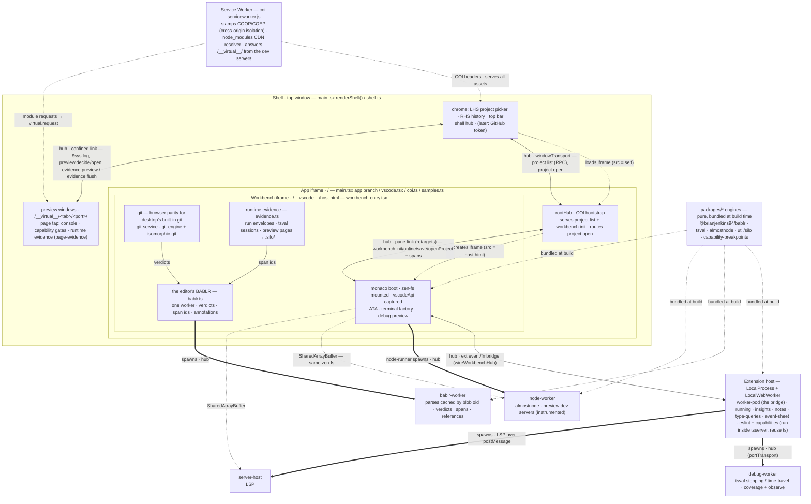

# editor — architecture & "where does this code go?"

The editor spans ~six runtime **realms** (separate JS execution contexts). Most "where should this live?"
confusion is really "which realm does it need to run in?" — so this doc is the realm map plus a placement
procedure. For the capability-overlay subsystem specifically, read `extensions/capabilities/ARCHITECTURE.md`
after this; this doc is the whole-editor picture.

## The two axes behind every placement decision

1. **Which realm?** — decided by *what the code needs to touch* (DOM? the vscode API? the workspace filesystem?
   tsserver's Program? heavy CPU?). Placement follows the CAPABILITY the code needs, not the feature it belongs to.
2. **Engine or binding?** — a pure, reusable **engine** (fewest host deps, node-testable) kept separate from a thin
   **binding** that maps it into one realm. This axis cuts across every realm.

**Portability caveat — the tie-breaker on Axis 1.** The **workbench iframe** realm is *our* custom
monaco-vscode-api boot; it does **not** exist in desktop VS Code, and neither do the browser shims that recreate
what desktop ships built-in. Split product functionality by one question: **does desktop VS Code already provide
this?**

- **Browser-parity shim** — desktop gives it to you out of the box; we only rebuilt it because the browser lacks the
  underpinning (e.g. **git SCM**: desktop's bundled git extension provides it, but that shells out to a `git` binary
  the browser has none of). This is a **browser-host concern**. It is *not* meant to port (desktop uses its own), so
  keep it browser-side — the workbench realm, or a browser-only extension — and do **not** dress it up as a portable
  product extension (no `extensions/git/`; that would imply we ship SCM to desktop, which we don't).
- **Novel functionality** — desktop does *not* provide it (e.g. the capability overlay; the **BABLR cosmetic/
  semantic classifier**). *This* is what should be **portable** → a self-contained **extension** (ext host,
  `vscode.workspace.fs`, spawning its own workers) that runs on both our browser host and desktop VS Code, layered
  on top of whatever SCM/host is present. The `capabilities` extension is the model.

Reserve `workbench-entry` (the workbench realm) for host-**boot glue** proper (the monaco `boot()` call, mounting
zen-fs, the terminal process factory, registering extensions) — and for browser-parity shims that have nowhere more
natural to sit. **Known debt:** the BABLR classifier is currently welded into our browser git SCM (workbench realm);
as *novel* functionality it should be extracted into a standalone extension, decoupled from our git provider, so it
also works over desktop's built-in git.

## The realms

| Realm | Entry / key files | Can access | What lives here |
|---|---|---|---|
| **Shell** (top window) | `main.tsx` `renderShell()` branch, `shell.ts`, `git-panel.ts` | DOM, the shell hub; *later* the GitHub token (trust boundary) | Surrounding chrome: LHS project picker, top bar, and the RHS **git review panel** (`git-panel.ts` — GitHub-Desktop-style changes/diff/commit, a pure hub consumer of `git.*`). Loads the app in an iframe pointing back at the same page. |
| **App iframe** (`/`) | `main.tsx` app branch, `coi.ts`, `vscode.tsx`, `samples.ts`, `pane-link.ts` | DOM, `rootHub`, COI bootstrap | Boots the workbench iframe (the preview windows live in the shell; this realm runs their backend — see below) and links it into `rootHub` over the retargeting pane-link transport; serves `project.list` + `workbench.init`, routes `project.open` → `openProject`. Owns the top of the hub tree. |
| **Workbench iframe** (`/__vscode__/host.html`) | `workbench-entry.tsx`, `workspace-fs.ts`, `ata.ts`, `terminal.ts`, `node-runner.ts`, `git-service.ts` | **the vscode API *and* zen-fs** (both live here), DOM — but it is OUR boot, so nothing here ports to desktop VS Code | Host-boot glue: the monaco `boot()` (VS Code's full workbench lays itself out — its own activity bar, sashes, movable views and remembered layout, minus the menu bar and title bar, which the shell's chrome replaces), mounting zen-fs, capturing the vscode API, the terminal process factory, registering extensions, spawning the workers. *(Core lives here too: the git engine and service — legitimate browser parity for desktop's built-in git; VS Code's Source Control view on it is worker-pod's — the editor's BABLR (`bablr.ts`: one worker, its parses cached by blob oid, answering the git panel's verdicts, runtime evidence's span ids, and extensions' annotation references and resolutions), and runtime evidence (`evidence.ts`: each run's envelope, and what tsval sessions and preview pages observed, folded into `.silo/`). The cosmetic classifier the git service asks is the part that should become a standalone extension — see the known debt above.)* |
| **Extension host** (`LocalProcess` / `LocalWebWorker`) | `extensions/*/extension.ts`, `extensions/*/ts-plugin.js` | the vscode API — **no DOM, no zen-fs singleton** | Extensions: `worker-pod` (the bridge: core's vscode API is its; spawns the LSP/debug/node workers; debug adapters, tasks, Source Control; core's BABLR to extensions as `editor.annotations.*`), `running`, `insights` (coverage, the evidence hover and hints), `notes`, `type-queries` and `event-sheet` (public API only). `eslint` + `capabilities` run in the WebWorker host *inside tsserver*, reusing tsserver's own `ts` as TS-plugins; the capabilities plugin also answers `_types.at` (TypeScript's types at ranges, for runtime evidence and the typed annotation strategy). |
| **Workers** (`dist/lsp/*`, spawned from the workbench realm) | only what is messaged in | nothing host-y | Heavy/blocking compute, off the UI thread: `node-worker` (almostnode/preview), `debug-worker` (tsval stepping), `server-host`, `bablr-worker` (the editor's BABLR, for `bablr.ts`: parses cached by blob oid in its own IndexedDB; cosmetic verdicts, span ids for runtime evidence, annotation references and resolutions). (The event sheet's recognizer worker is its extension's own, spawned in the extension host.) |
| **Packages** (`packages/*`, plain node) | nothing host-y — pure | — | Engines: `@brianjenkins94/bablr` (upstream BABLR and our grammar, `bablr-language-ts`, bundled: `cstSpans`, span ids, `reidentify`/`follow`, `classifyChange`), `tsval` (the interpreter, and its `observe` hook), `almostnode` (the node runtime and previews' dev server, which instruments workspace modules for runtime evidence), `util/silo` (the shared policy model, runtime evidence and span annotations: pure models and layouts), and the vscode-package-local pure module `capability-breakpoints`. Built/aliased into the realms above. |

There is also a **service worker** (`coi-serviceworker.js`, registered by `coi.ts`): one per origin, it stamps the
COOP/COEP headers that make every realm cross-origin-isolated (SharedArrayBuffer) on a static host, and resolves the
CDN `node_modules` overlay. Not a place you put feature code.

## Cross-realm communication

- **hub** (`@brianjenkins94/hub`) — the composed message tree for *everything*, including the workbench boot
  handshake: pub/sub + RPC (`createRpcClient` / `serve`). Shape today: shell ↔ app over `windowTransport`; app
  `rootHub` ↔ workbench hub over the **pane-link** transport (`pane-link.ts`) — a `windowTransport` variant that
  *retargets* to the pane's live window so it survives a pop-out; workbench ↔ extension pod over the pod's exported
  event/function bridge; pod ↔ its workers over `portTransport`. A message only crosses a link if the far side
  subscribed, so each realm runs standalone. The app↔workbench boot handshake is just hub messages on that link:
  the pane requests `workbench.init` (RPC, retried until interest settles), then publishes `workbench.online` /
  `workbench.save`, and the host publishes `workbench.openProject`. (This folded the old separate `pane-bus` + a
  dedicated `MessagePort` into one hub link; hub's `hello` handshake covers the lossy-window race the port guarded.)
- **plain postMessage** — only where the hub can't or mustn't go: a protocol dictated by someone else (LSP to
  `server-host`), or a realm that must stay bare (the capability-gated eval sandbox). Every other worker — even a
  single-purpose one like `bablr-worker` — joins the tree with its own hub (`worker-hub.ts`) and `serve`s its
  methods: calls get timeouts, cancellation and worker-failure handling from the hub instead of a hand-rolled
  id→pending map, show up by name on the live architecture view, and can be called from anywhere in the tree.
- **shared memory** — the workspace filesystem (below). No messages at all, so the live view observes it by wrapping
  each realm's `/workspace` mount (`architecture-zenfs.ts`).

### The live preview, end to end

`npm run dev` in the terminal runs the workspace's `vite` script → the terminal publishes `preview.open` → root
(`preview.ts`) asks the node worker to `preview.start` almostnode's in-browser Vite dev server on that port and
publishes `preview.ready` → the shell (`shell-preview.ts`) opens a window whose iframe loads
`<base>/__virtual__/<tab>/<port>/`. Every request from that iframe is answered by the **service worker**, which calls
the dev server over the hub (`virtual.request.<tab>` to that tab's root, which asks its node worker). The previewed app's bare imports resolve to
**esm.sh** and pass through the service worker. When anything changes the workspace (a save, a git checkout, a
script), the dev server hears it on `workspace.changed` and emits an HMR update on `preview.hmr.<port>` → the shell
posts it into the iframe. Back up the other way, everything rides the window's hub: the dev server inlines a tap as
each page's first script (`page-tap.ts`), and a window's top frame holds its one hub into the editor — the tap's, which
the shell links (confined: `previewAppPermissions`) and names as the window. Its console and errors go out on
`$sys.log`, WebSocket/WebRTC capability requests as `preview.decide` and new windows as `preview.open` (the shell knows
the window from the link, never from what the page says); frames nested in the window use the top frame's tap
directly, and the app's own hub, if it has one, joins through it (observability's `linkPreviewHost`). A worker the page
starts joins the window's hub through the page: the page tap hands it a port as its first message (`WORKER_OFFER`), and
its tap (`worker-tap.ts`) sends its records and capability questions through the page's (`tap.worker.log`,
`tap.worker.decide`). A node script's fs writes ask the service worker synchronously (`POST /__capability__/decide`).
On the live diagram: `preview:<port>` (the iframe) and `vite:<port>` (its dev server) come and go with the preview.

**What a preview's code does is runtime evidence** (RUNTIME-EVIDENCE.md, the third slice). As a preview starts, the
dev server asks core how much to instrument (`evidence.level`, the `silo.evidence.previews` setting) and compiles each
workspace module through almostnode's instrumenting transformer, naming each version by its source's blob oid. The page
tap carries the page runtime (`page-evidence.ts`), which counts what the modules report, by file and version, so a hot
update's re-import counts on. Each page reports its totals on `evidence.preview` — every 10 s while they change, on a hot
update, on `pagehide`, and when core asks (`evidence.flush`, which the `vite` command sends before the windows close).
Core (`evidence.ts`) finds the run by the window's port, asks the dev server for each new version's source
(`preview.version`), and when the run ends folds every version into the files' evidence in `.silo/`.

**A server has as many windows as the user opens**, like browser tabs onto one dev server — and no address bar. A
window's "new window" button opens another onto the same server; so does the app itself, opening one of its pages as
a new window (`window.open`, a `target="_blank"` link): the tap hands that up (`preview.open`) instead of letting it
leave the editor as a browser tab. Each window is its own page — its own reload, DevTools, capability prompts and hub
link — named `preview:<port>` (the port's first) or `preview:<port>~<n>`; HMR reaches all of them; closing one closes
just it, and closing a server's last window (or Ctrl-C on `vite`) stops the server. An app's hubs name themselves (every
window of one app has a `page`), so the edge names them: the shell renames each window's observability as it enters
the editor's tree (observability's `scopedTransport`) — the window's hub (its tap's) IS `preview:<port>~<n>`, the app's
hubs `preview:<port>~<n>/<hub>` — never two `page`s merged. Where each runs is reported, not guessed: a frame's realm names
its parent's address, and the page's tap tags each worker it starts with its page and window (its URL's hash), so a
worker sits under the realm that started it and its logs and capability requests go to its window.
Two ports are two servers; in the editor they share one origin (ports are paths under `/__virtual__/`), which a desktop
wouldn't — so an app can't rely on origin-scoped state crossing ports.

**The service worker keeps no state.** The browser stops an idle service worker and starts a fresh global on the
next event, so it remembers nothing between requests: it asks the page for a hub link whenever it starts
(`sw-needs-hub`), and asks the pod for every capability decision (the pod maps a preview's port to its run). Its
calls wait for a responder (`waitForResponderMs`) instead of publishing into an unlinked hub, and the capability gate
**fails closed**: with no decider reachable, a preview's data fetch gets a 403 and a node script's write is denied.

**One service worker serves every tab.** It links each tab's root hub separately and **non-transit** (a hub link
option: nothing passes between two non-transit links), so tabs are never joined through it, and it addresses what it
asks to the tab it's for — `virtual.request.<tab>`, `capability.decide.<tab>`, which only that tab's root answers,
from its own tree. The tab comes from the preview's URL, or, for a node script's decision, from the node worker (its
URL carries the tab). debug-mcp links every open tab the same way (non-transit), for the same reason.

**The preview is not a security boundary.** Its iframe is same-origin with the editor and unsandboxed, by necessity:
a sandboxed (opaque-origin) frame isn't controlled by the service worker, so `/__virtual__/` would never reach the dev
server (verified: `sandbox="allow-scripts"` renders nothing), and it would lose cross-origin isolation, so no
`SharedArrayBuffer` for previewed apps. Adding `allow-same-origin` back makes the sandbox escapable. So a previewed app
can reach `window.parent` (the editor's DOM, storage, hub), and the capability gate guards against accidents, not
hostile code. A real boundary needs the preview on a separate origin with its own service worker.

### The workspace filesystem (zen-fs)

The workbench creates a 64 MB `SharedArrayBuffer` zen-fs store (`workspace-fs.ts`) mounted at `/workspace` and hands
the buffer to the node worker (over the hub, `workspace.buffer`) and the cspell server host (a one-shot control port —
it has no hub); the provoke child gets it directly, and a debug run in its launch (the pod holds it). All of them read and write the same bytes under an Atomics lock.

Shared memory tells nobody anything, so there is **one change stream** (`workspace-changes.ts`): each realm watches its
own mount's mutating store operations and reports them, batched, as `workspace.changed`. The workbench persists every
change to IndexedDB (`workspace-fs`, 500 ms debounce — it copies the path's current state, so a deleted or renamed tree
goes with it) and announces it to VS Code as a file-change event (except `.git/**`, whose writes the git watchers
cause); the node worker's dev servers hot-reload from it. So a write is saved and seen the same way whoever made it:
the editor's provider, isomorphic-git, the terminal, a node script. The live view labels workbench operations by caller
(`vscode ·`, `direct ·`, `seed ·`, `restore ·`, `persist ·`).

### The metrics plane

Beside the logs (`$sys.log`) and the architecture (`$sys.arch`), each context can publish numbers once a second on
`$sys.metrics.<source>` (observability's `reportMetrics`: named gauges, read at each sample). The workbench reports
memory by realm (`measureUserAgentSpecificMemory`, about every 30 s: it waits for a garbage collection), the workspace's fill (read from the zen-fs superblock),
its time in long animation frames, hub traffic and the origin's storage; the shell reports its own long frames
(`editor-metrics.ts`). The pod keeps the last five minutes of each and serves them to VS Code as the
`editor.metrics.read` command, which the insights extension's monitor (status bar + a view of sparkline cards) reads —
so the monitor, like the rest of insights, uses nothing but VS Code's API. Memory is named by realm: the editor's own by
path, and the `blob:` workers (the web worker extension host, TypeScript's servers, the language servers, monaco's
workers) by the architecture probes, which put each worker's URL on its node — a probed worker reports its own in its
`hello`.

The host page reports `spans`: every context's timed spans (`→ cdn` / `← cdn (12ms)`) as rates, errors and latencies per
`source/name` — ended per second over the last 10 s, how many had an error logged inside them, p50/p95, and how many are
open — computed from the records its collector already receives, so no subsystem does anything to be measured. A
failing operation (a CDN fetch, a type acquisition) shows in the monitor's status bar while it fails. debug-mcp keeps
five minutes of each tab's plane too: `query_metrics` summarizes any series over a window (latest, min, max, mean, and
the readings when asked), the same numbers the monitor draws.

### Side channels (off the hub, on purpose)

Everything that can ride the hub does. What doesn't, and why:

- **the capability decide route** — a node script's `writeFileSync` must block, so it asks with a synchronous XHR the
  service worker answers; the SW then asks the pod over the hub.
- **the cspell server host's control port** — it speaks LSP over its worker port and has no hub; the pod hands it the
  workspace buffer once, at spawn (a respawned worker gets it again).
- **a preview's HMR posts** — HMR updates go into the iframe as plain posts. Everything else of a preview window —
  its workers' records and questions too, through its page's tap — rides its hub link, confined (the previewed app is
  untrusted: `previewAppPermissions`).
- **the tsval render surface's port** — a `MessagePort` handed over in a `preview-ready` → `init` handshake, redone
  whenever the surface reloads.

## Diagram — realms & channels

```mermaid
flowchart TB
  SW["Service Worker — coi-serviceworker.js<br/>stamps COOP/COEP (cross-origin isolation) · node_modules CDN resolver · answers /__virtual__/ from the dev servers"]

  subgraph SHELL["Shell · top window — main.tsx renderShell() / shell.ts"]
    S["chrome: LHS project picker · RHS history · top bar<br/>shell hub · (later: GitHub token)"]
    PV["preview windows · /__virtual__/&lt;tab&gt;/&lt;port&gt;/<br/>page tap: console · capability gates · runtime evidence (page-evidence)"]
    subgraph APP["App iframe · / — main.tsx app branch / vscode.tsx / coi.ts / samples.ts"]
      A["rootHub · COI bootstrap<br/>serves project.list + workbench.init · routes project.open"]
      subgraph WB["Workbench iframe · /__vscode__/host.html — workbench-entry.tsx"]
        W["monaco boot · zen-fs mounted · vscodeApi captured<br/>ATA · terminal factory · debug preview"]
        GIT["git — browser parity for desktop's built-in git<br/>git-service · git-engine + isomorphic-git"]
        BAB["the editor's BABLR — bablr.ts<br/>one worker · verdicts · span ids · annotations"]
        EV["runtime evidence — evidence.ts<br/>run envelopes · tsval sessions · preview pages → .silo/"]
      end
    end
  end

  EXT["Extension host — LocalProcess + LocalWebWorker<br/>worker-pod (the bridge) · running · insights · notes · type-queries · event-sheet · eslint + capabilities (run inside tsserver, reuse ts)"]

  NW["node-worker<br/>almostnode · preview dev servers (instrumented)"]
  DW["debug-worker<br/>tsval stepping / time-travel · coverage + observe"]
  SH["server-host<br/>LSP"]
  CW["bablr-worker<br/>parses cached by blob oid · verdicts · spans · references"]

  PKG["packages/* engines — pure, bundled at build time<br/>@brianjenkins94/bablr · tsval · almostnode · util/silo · capability-breakpoints"]

  S -.->|"loads iframe (src = self)"| A
  A -.->|"creates iframe (src = host.html)"| W

  S <-->|"hub · windowTransport — project.list (RPC), project.open"| A
  S <-->|"hub · confined link — $sys.log, preview.decide/open, evidence.preview / evidence.flush"| PV
  A <-->|"hub · pane-link (retargets) — workbench.init/online/save/openProject + spans"| W
  W <-->|"hub · ext event/fn bridge (wireWorkbenchHub)"| EXT

  W ==>|"node-runner spawns · hub"| NW
  EXT ==>|"spawns · hub (portTransport)"| DW
  EXT ==>|"spawns · LSP over postMessage"| SH
  BAB ==>|"spawns · hub"| CW
  GIT -->|"verdicts"| BAB
  EV -->|"span ids"| BAB

  W -.->|"SharedArrayBuffer — same zen-fs"| NW
  W -.->|"SharedArrayBuffer"| SH

  SW -.->|"COI headers · serves all assets"| S
  SW -.->|"module requests → virtual.request"| PV
  PKG -.->|"bundled at build"| W
  PKG -.->|"bundled at build"| EXT
  PKG -.->|"bundled at build"| CW
  PKG -.->|"bundled at build"| NW
```

Edge styles: **solid arrows** = live message channels; **thick arrows** = a realm spawning a worker; **dotted arrows**
= frame creation, shared-memory, service-worker serving, and build-time bundling. Nesting = iframe containment
(shell ▸ app ▸ workbench).

## Observed architecture (generated by the tour)

The diagram above is the narrative, and says what can't be seen (what's bundled at build time). This one is what the
**architecture tour** (`test/architecture-tour.mjs`) saw the editor do — every context, extension and store, and what
joined them; then the stores, with who writes and who reads each; then each hub's components — rendered by
`tourDiagram()` with nothing declared but where things run (DISCOVERED-ARCHITECTURE.md). Instances read as one of a kind
(`Preview :*`), and there are no counts, so the same tour renders the same block. A local run of the tour rewrites it;
the architecture workflow re-runs the tour and fails when it differs — so a change that adds a part, a channel or a store
shows up here, in the same commit. Hub links are `<==>`, other channels `<-.->` (labelled by their protocol, or
`undeclared`), an extension's commands `commands`, and a store's edges say whether it's read or written.

What the model in `architecture-model.ts` still declares is the rules: which way each subject family may travel, why a
direct channel isn't a hub link, what a preview window's link allows, and where each context runs. The **live
architecture view** (*Developer: Open Live Architecture Diagram*) checks what it observes against them.

<!-- architecture-tour:begin -->

```mermaid
flowchart LR
  subgraph c_shell["Shell"]
    n_shell["Shell"]
    subgraph c_previews["Preview windows"]
      n_preview__["Preview :*"]
      n_tsval_preview["tsval preview"]
    end
  end
  subgraph c_app["App iframe"]
    n_root["Root"]
  end
  subgraph c_workbenchIframe["Workbench iframe"]
    n_webview_markdown_preview["markdown.preview"]
    subgraph c_workbench["Main thread"]
      n_ext_vscode["VS Code"]
      n_ext_worker_pod["worker-pod"]
      n_exthost_LocalProcess_0["Local extension host"]
      n_pod["Pod"]
      n_workbench["Workbench"]
    end
    subgraph c_editorWorkers["Editor workers"]
      n_worker_TextMateWorker["TextMate worker"]
      n_worker_editorWorkerService["Editor worker"]
      n_worker_perfBaseline["Perf baseline worker"]
    end
    subgraph c_workers["App workers"]
      n_bablr["BABLR worker"]
      n_node["Dev-server worker"]
      n_node_scripts["Script worker"]
      n_provoke["Provoke worker"]
      n_vite__["Vite dev server :*"]
    end
    subgraph c_podWorkers["Pod workers"]
      n_debug_worker["Debug worker"]
      n_worker_server_host["LSP server host"]
    end
    subgraph c_extHostIframe["Extension host iframe"]
      n_exthost_iframe["Iframe relay"]
      subgraph c_extHostWorker["Web worker extension host"]
        n_ext_capabilities["capabilities"]
        n_ext_eslint["eslint"]
        n_ext_insights["insights"]
        n_ext_notes["notes"]
        n_ext_running["running"]
        n_exthost_LocalWebWorker_0["Worker extension host"]
        n_nested_TS_semantic_server["TS semantic server"]
        n_nested_TS_syntax_server["TS syntax server"]
        n_nested_jsonServerMain_js["jsonServerMain.js"]
        n_nested_serverWorkerMain_js["serverWorkerMain.js"]
      end
    end
  end
  subgraph c_browserChannels["Browser channels"]
    n_channel_vscode_indexedDB_vscode_userdata_changes["vscode.indexedDB.vscode-userdata.changes"]
    n_channel_vscode_web_state_db_global["vscode-web-state-db-global"]
    n_channel_vscode_web_state_db_global_shared["vscode-web-state-db-global-shared"]
  end
  subgraph c_stores["Stores"]
    n_store__git__file_[".git/&lt;file&gt;"]
    n_store__git_objects____file_[".git/objects/…/&lt;file&gt;"]
    n_store__git_refs____file_[".git/refs/…/&lt;file&gt;"]
    n_store__silo__file__json[".silo/&lt;file&gt;.json"]
    n_store__silo__file__jsonl[".silo/&lt;file&gt;.jsonl"]
    n_store__silo__gitattributes[".silo/.gitattributes"]
    n_store__silo__gitignore[".silo/.gitignore"]
    n_store__silo_evidence____file__jsonl[".silo/evidence/…/&lt;file&gt;.jsonl"]
    n_store__silo_local____file__bin[".silo/local/…/&lt;file&gt;.bin"]
    n_store__silo_local____file__jsonl[".silo/local/…/&lt;file&gt;.jsonl"]
    n_store__silo_local__file__json[".silo/local/&lt;file&gt;.json"]
    n_store__silo_notes____file__jsonl[".silo/notes/…/&lt;file&gt;.jsonl"]
    n_store__silo_runs__file__jsonl[".silo/runs/&lt;file&gt;.jsonl"]
  end
  subgraph c_sharedMemory["Shared memory"]
    n_zenfs["Workspace (zen-fs)"]
  end
  subgraph c_browser["Browser"]
    n_idb["IndexedDB"]
  end
  subgraph c_network["Network (service worker)"]
    n_debug_mcp["debug-mcp"]
    n_net_esm_sh["esm.sh"]
    n_net_lighter_codehike_org["Code Hike"]
    n_net_open_vsx_org["Open VSX"]
    n_net_origin["Page origin"]
    n_net_unpkg_com["unpkg"]
    n_sw["Service worker"]
    n_webview_sw["Webview service worker"]
  end
  n_bablr <-.->|"IndexedDB"| n_idb
  n_bablr <==> n_workbench
  n_channel_vscode_indexedDB_vscode_userdata_changes <-.->|"VS Code user-data sync"| n_workbench
  n_channel_vscode_web_state_db_global <-.->|"VS Code storage sync"| n_workbench
  n_channel_vscode_web_state_db_global_shared <-.->|"VS Code storage sync"| n_workbench
  n_debug_mcp <==> n_root
  n_debug_worker <==> n_pod
  n_ext_capabilities -->|"reads, writes"| n_store__silo__file__json
  n_ext_eslint <-.->|"commands"| n_ext_vscode
  n_ext_insights -->|"reads"| n_store__silo_evidence____file__jsonl
  n_ext_insights -->|"reads"| n_store__silo_local____file__jsonl
  n_ext_insights <-.->|"commands"| n_ext_vscode
  n_ext_insights <-.->|"commands"| n_ext_worker_pod
  n_ext_notes -->|"reads"| n_store__git__file_
  n_ext_notes -->|"reads"| n_store__silo__gitattributes
  n_ext_notes -->|"reads"| n_store__silo_evidence____file__jsonl
  n_ext_notes -->|"reads, writes"| n_store__silo_notes____file__jsonl
  n_ext_notes <-.->|"commands"| n_ext_vscode
  n_ext_notes <-.->|"commands"| n_ext_worker_pod
  n_ext_vscode <-.->|"commands"| n_ext_worker_pod
  n_ext_worker_pod -->|"reads"| n_store__git__file_
  n_ext_worker_pod -->|"reads, writes"| n_store__silo__file__json
  n_ext_worker_pod -->|"reads, writes"| n_store__silo__file__jsonl
  n_ext_worker_pod -->|"reads, writes"| n_store__silo__gitignore
  n_ext_worker_pod -->|"reads, writes"| n_store__silo_local__file__json
  n_ext_worker_pod <-.->|"commands"| n_ext_worker_pod
  n_exthost_LocalProcess_0 <-.->|"RPCProtocol"| n_workbench
  n_exthost_LocalWebWorker_0 <-.->|"HTTP"| n_sw
  n_exthost_LocalWebWorker_0 <-.->|"RPCProtocol"| n_workbench
  n_exthost_LocalWebWorker_0 <-.->|"extension defined (LSP, tsserver)"| n_nested_TS_semantic_server
  n_exthost_LocalWebWorker_0 <-.->|"extension defined (LSP, tsserver)"| n_nested_TS_syntax_server
  n_exthost_LocalWebWorker_0 <-.->|"extension defined (LSP, tsserver)"| n_nested_jsonServerMain_js
  n_exthost_LocalWebWorker_0 <-.->|"extension defined (LSP, tsserver)"| n_nested_serverWorkerMain_js
  n_exthost_iframe <-.->|"bootstrap handshake"| n_workbench
  n_idb <-.->|"IndexedDB"| n_workbench
  n_idb <-.->|"IndexedDB"| n_zenfs
  n_net_esm_sh <-.->|"HTTP"| n_sw
  n_net_lighter_codehike_org <-.->|"HTTP"| n_sw
  n_net_open_vsx_org <-.->|"HTTP"| n_sw
  n_net_origin <-.->|"HTTP"| n_sw
  n_net_unpkg_com <-.->|"HTTP"| n_sw
  n_node <-.->|"in-realm calls"| n_vite__
  n_node <-.->|"zen-fs"| n_zenfs
  n_node <==> n_provoke
  n_node <==> n_workbench
  n_node_scripts <==> n_workbench
  n_pod <-.->|"LSP (JSON-RPC)"| n_worker_server_host
  n_pod <==> n_workbench
  n_preview__ <-.->|"HTTP"| n_sw
  n_preview__ <==> n_shell
  n_provoke <-.->|"zen-fs"| n_zenfs
  n_root <==> n_shell
  n_root <==> n_sw
  n_root <==> n_workbench
  n_shell <-.->|"HTTP"| n_sw
  n_shell <-.->|"tsval render protocol"| n_tsval_preview
  n_sw <-.->|"HTTP"| n_workbench
  n_sw <-.->|"HTTP"| n_worker_TextMateWorker
  n_webview_markdown_preview <-.->|"VS Code webview protocol"| n_workbench
  n_webview_sw <-.->|"VS Code webview resources"| n_webview_markdown_preview
  n_workbench -->|"reads, writes"| n_store__git__file_
  n_workbench -->|"reads, writes"| n_store__git_objects____file_
  n_workbench -->|"reads, writes"| n_store__git_refs____file_
  n_workbench -->|"reads, writes"| n_store__silo__file__json
  n_workbench -->|"reads, writes"| n_store__silo__file__jsonl
  n_workbench -->|"reads, writes"| n_store__silo__gitattributes
  n_workbench -->|"reads, writes"| n_store__silo__gitignore
  n_workbench -->|"reads, writes"| n_store__silo_evidence____file__jsonl
  n_workbench -->|"reads, writes"| n_store__silo_local____file__jsonl
  n_workbench -->|"reads, writes"| n_store__silo_local__file__json
  n_workbench -->|"reads, writes"| n_store__silo_notes____file__jsonl
  n_workbench -->|"reads, writes"| n_store__silo_runs__file__jsonl
  n_workbench -->|"writes"| n_store__silo_local____file__bin
  n_workbench <-.->|"WebWorker protocol / postMessage"| n_worker_TextMateWorker
  n_workbench <-.->|"WebWorker protocol / postMessage"| n_worker_editorWorkerService
  n_workbench <-.->|"WebWorker protocol / postMessage"| n_worker_perfBaseline
  n_workbench <-.->|"zen-fs"| n_zenfs
  n_worker_server_host <-.->|"zen-fs"| n_zenfs
```

| Store | Written by | Read by |
| --- | --- | --- |
| `.git/<file>` | Workbench | Workbench, notes, worker-pod |
| `.git/objects/…/<file>` | Workbench | Workbench |
| `.git/refs/…/<file>` | Workbench | Workbench |
| `.silo/.gitattributes` | Workbench | Workbench, notes |
| `.silo/.gitignore` | Workbench, worker-pod | Workbench, worker-pod |
| `.silo/<file>.json` | Workbench, capabilities, worker-pod | Workbench, capabilities, worker-pod |
| `.silo/<file>.jsonl` | Workbench, worker-pod | Workbench, worker-pod |
| `.silo/evidence/…/<file>.jsonl` | Workbench | Workbench, insights, notes |
| `.silo/local/…/<file>.bin` | Workbench | — |
| `.silo/local/…/<file>.jsonl` | Workbench | Workbench, insights |
| `.silo/local/<file>.json` | Workbench, worker-pod | Workbench, worker-pod |
| `.silo/notes/…/<file>.jsonl` | Workbench, notes | Workbench, notes |
| `.silo/runs/<file>.jsonl` | Workbench | Workbench |
| `IndexedDB bablr` | BABLR worker | BABLR worker, Workbench |
| `IndexedDB silo-local` | Workspace (zen-fs) | Workspace (zen-fs) |
| `IndexedDB vscode-web-db` | Workbench | Workbench |
| `IndexedDB vscode-web-state-db--*` | Workbench | Workbench |
| `IndexedDB vscode-web-state-db-global` | Workbench | Workbench |
| `IndexedDB vscode-web-state-db-global-shared` | Workbench | Workbench |
| `IndexedDB workspace-fs` | Workspace (zen-fs) | Workspace (zen-fs) |

| Hub | Component | Serves and hears |
| --- | --- | --- |
| BABLR worker | bablr | `bablr.editGroups()`, `bablr.follow()`, `bablr.pick()`, `bablr.refer()`, `bablr.resolve()`, `bablr.spans()`, `bablr.verdict()` |
| Dev-server worker | preview | `preview.close`, `preview.provoke()`, `preview.start()`, `preview.version()` |
| Dev-server worker | virtual | `virtual.request()` |
| Dev-server worker | workspace | `workspace.changed` |
| Pod | capability | `capability.decide()`, `capability.record()`, `capability.recorded()` |
| Pod | debug | `debug.breakpoints()`, `debug.command`, `debug.explore()`, `debug.launch`, `debug.session.*.decide()`, `debug.session.*.event`, `debug.session.*.pace()`, `debug.session.*.setValue()`, `debug.session.*.state()`, `debug.session.*.stdin()`, `debug.session.*.step()`, `debug.session.*.stop()`, `debug.sessions()`, `debug.start()`, `debug.stop` |
| Pod | git | `git.changed` |
| Pod | node | `node.exit.*`, `node.start` |
| Pod | pod | `pod.ready` |
| Pod | production | `production.exit.*`, `production.launch`, `production.out.*` |
| Pod | rules | `rules.given()`, `rules.list()`, `rules.placed()`, `rules.set()` |
| Pod | tasks | `tasks.list()`, `tasks.run()` |
| Pod | tsval | `tsval.preview.event`, `tsval.preview.hello`, `tsval.preview.stream`, `tsval.preview.timeTravel` |
| Preview :* | evidence | `evidence.flush` |
| Preview :* | tap | `tap.worker.decide()`, `tap.worker.log` |
| Root | capability | `capability.decide.*()`, `capability.record.*()` |
| Root | page_tools | `page_tools.*()` |
| Root | preview | `preview.close`, `preview.open` |
| Root | project | `project.list()`, `project.open`, `project.openFiles` |
| Root | tab | `tab.discover` |
| Root | tool | `tool.debug_breakpoints.*()`, `tool.debug_sessions.*()`, `tool.debug_start.*()`, `tool.debug_state.*()`, `tool.debug_step.*()`, `tool.debug_stop.*()`, `tool.page_eval.*()`, `tool.page_query.*()`, `tool.preview_cdp.*()`, `tool.preview_profile.*()`, `tool.provoke_transform.*()`, `tool.runs.*()` |
| Root | virtual | `virtual.request.*()` |
| Root | workbench | `workbench.init()`, `workbench.online`, `workbench.save` |
| Root | workspace | `workspace.files()` |
| Shell | capability | `capability.prompt()` |
| Shell | debug | `debug.state` |
| Shell | dock | `dock.closeWindow`, `dock.openWindow()` |
| Shell | git | `git.changed` |
| Shell | preview | `preview.cdp()`, `preview.close`, `preview.decide()`, `preview.hmr.*`, `preview.open`, `preview.open()`, `preview.profile()`, `preview.ready` |
| Shell | tsval | `tsval.preview.close`, `tsval.preview.open`, `tsval.preview.stream` |
| Workbench | annotations | `annotations.refer()`, `annotations.resolve()` |
| Workbench | capability | `capability.ask` |
| Workbench | debug | `debug.declined.*` |
| Workbench | dock | `dock.closeEditor()`, `dock.hostEditor()` |
| Workbench | evidence | `evidence.level()`, `evidence.observed`, `evidence.preview` |
| Workbench | git | `git.classify()`, `git.commit()`, `git.discard()`, `git.file()`, `git.status()` |
| Workbench | history | `history.chunks()`, `history.texts()` |
| Workbench | node | `node.exit.*`, `node.listening.*`, `node.out.*`, `node.ready` |
| Workbench | preview | `preview.close`, `preview.hmr.*`, `preview.profiled` |
| Workbench | production | `production.stop.*` |
| Workbench | rules | `rules.make()` |
| Workbench | runs | `runs.begin()`, `runs.list()`, `runs.stop()` |
| Workbench | terminal | `terminal.run()` |
| Workbench | theme | `theme.colorScheme` |
| Workbench | values | `values.ended`, `values.session.*` |
| Workbench | workbench | `workbench.files()`, `workbench.openProject` |
| Workbench | workspace | `workspace.buffer()`, `workspace.changed` |
<!-- architecture-tour:end -->

## Placement procedure

Ask, in order:

1. **Pure logic, no host deps?** → a **package / engine module** (node-testable). *e.g. `classifyChange`, `git-engine`
   (no vscode dep), `silo/policy`, `capability-breakpoints`.*
2. **NOVEL product functionality** (desktop VS Code does *not* provide it)? → a self-contained **extension** in the
   ext host, reaching the workspace through **`vscode.workspace.fs`** (never a direct `zen-fs` import), and
   **spawning any heavy worker itself**. Model: the `capabilities` extension. *The BABLR cosmetic classifier belongs
   here — it is currently welded into our browser git SCM (debt).*
   - **2b. Browser parity for a desktop built-in** (desktop provides it; we only rebuilt it for the browser — e.g.
     git SCM)? → keep it **browser-side** (the workbench realm, or a browser-only extension). It does **not** port,
     so do not make it a portable product extension.
3. **Needs tsserver's Program / to run during type-checking?** → a **TS-plugin in the WebWorker ext host**, reusing
   tsserver's `ts`. *e.g. `capabilities`, `eslint`.* (A special case of rule 2 — it ships in an extension.)
4. **Heavy or blocking** (parse, interpret, run node)? → a **worker**, async. Spawned by whoever owns it — the
   *extension* for extension functionality (portable), the workbench realm only for host-boot workers.
   *e.g. `bablr-worker` — BABLR is ~1.7s/file, it cannot run on the UI thread.*
5. **Chrome / layout / cross-project / token custody?** → the **shell**.
6. **Host-boot glue only** — things that only make sense for our monaco-vscode-api boot (the `boot()` call, mounting
   zen-fs, the terminal process factory, registering extensions)? → the **workbench realm** (`workbench-entry`). This
   is the *only* thing that legitimately lives there, because it does not port to desktop VS Code.

Then apply **Axis 2**: split the part with the fewest host deps into an **engine** and leave a thin **binding** in
the realm. If you can't node-test the logic, you probably haven't separated the engine yet.

## Worked examples (the git/SCM + BABLR stack)

The cosmetic-diff feature is the running example — and its git/SCM stack shows both the *right* target and the
*shortcut we took*:

- `classifyChange` / `cstSpans` — **package** (`@brianjenkins94/bablr`): pure, node-tested (rule 1). Correctly placed.
- `git-engine.ts` + `git-service.ts` — **browser parity for desktop's built-in git** (rule 2b): desktop ships the git
  extension; the browser has no `git` binary, so we rebuilt git over isomorphic-git + zen-fs. The engine lives
  **browser-side** (workbench realm) behind one service on the hub (`git.status`/`git.file`/`git.commit`, `git.changed`),
  with two faces: VS Code's Source Control view (worker-pod's `source-control.ts`, the bridge's crossing) and the
  shell's GitHub-Desktop review panel (`git-panel`). We do not ship SCM to desktop; desktop already has it.
  (`git-engine`'s direct `@zenfs/core` import is fine *here* — it's browser-only.)
- `bablr-worker.ts` + the cosmetic badge — the **novel** piece (rule 2): desktop has nothing like it. It is
  currently welded into our browser git (the git service asks it, and *our* Source Control view paints it). Its right
  home is a **standalone extension**, decoupled from our git provider, that reads HEAD vs working through vscode's own
  SCM/diff/fs APIs and adds the badge — so it works over desktop's built-in git too. *(This is the "bablr belongs in
  the extension" correction, correctly scoped: the classifier ports; the SCM shim does not.)* Recorded as debt.

The capability overlay is the template for that classifier extension: pure core (`silo/policy`,
`capability-breakpoints`) → a tsserver plugin (ext host) that emits diagnostics → an ext-host binding
(`extensions/capabilities/extension.ts`) that renders the panel. See `extensions/capabilities/ARCHITECTURE.md`.

## The one gotcha the realms impose

Cross-origin isolation (SharedArrayBuffer) must hold in **every** nested realm. The shell → app → workbench nesting
is all same-origin, and the service worker (prod) or dev headers stamp COOP/COEP, so isolation propagates — but a
new realm (another iframe, a worker) inherits it only under those same conditions. When adding a realm, confirm
`crossOriginIsolated` there before relying on SAB/Atomics.
